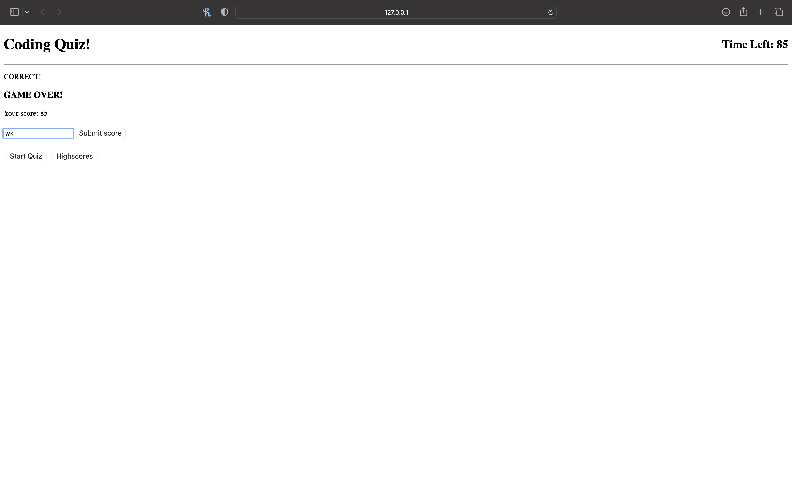
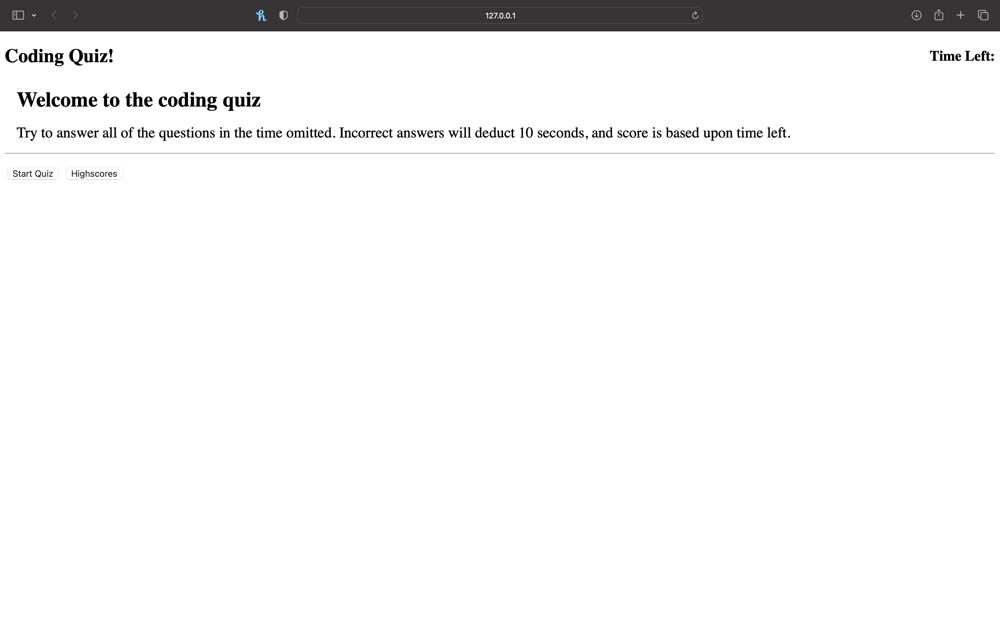
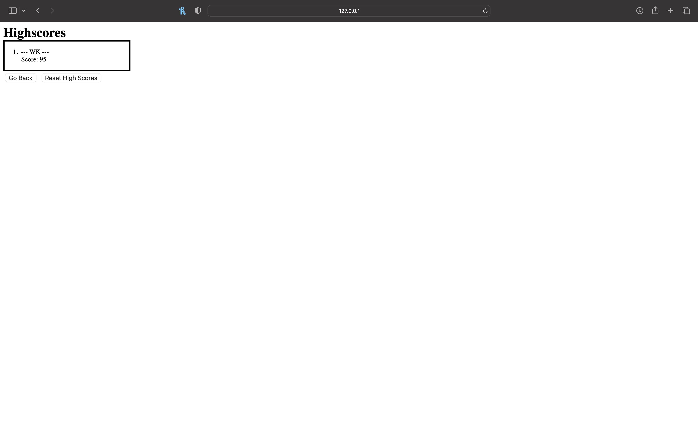

# ChallengeWk4-MiniQuiz

## Description

This web application is a multichoice mini-quiz about javascript topics. The reason for making this project is to create a study tool for javascript to use at will. The project consists questions that appear on the screen when the "Start Quiz" button is pressed, and displays a score at the end. There are 5 total questions in the mini-quiz. Once you save your score at the end of the quiz by saving your initials, they will save onto the "Highscore" page, where they are organized by score value.

## Usage 
Usage of the mini-quiz starts with the "Start Quiz" button, or by accessing the highscore page with the "Highscore" page. The user will click on the answer for the question that is highlighted in a black border. After answering all of the questions, it will ask user to enter initials that will save to your game score. When the user clicks on the "Submit Score" button, it will then prompt that the score was saved.
Screenshots:

## Deployment

https://westonkostura.github.io/ChallengeWk4-MiniQuiz/